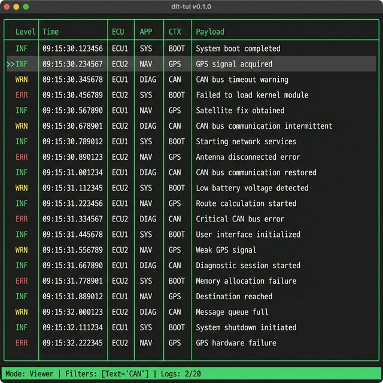

# 🚗 dlt-tui

[](https://crates.io/crates/dlt-tui)
[](https://opensource.org/licenses/MIT)

**A fast, keyboard-centric terminal viewer for Automotive DLT (Diagnostic Log and Trace) files.**

> Analyze AUTOSAR DLT logs directly in your terminal — no GUI needed. Perfect for ECU bring-up, test bench debugging, and CI pipeline log inspection.

<p align="center">
  
</p>

---

## Why dlt-tui?

| Pain Point                                | dlt-tui Solution                                                                   |
| ----------------------------------------- | ---------------------------------------------------------------------------------- |
| 🖥️ dlt-viewer requires a desktop GUI      | ✅ Works in any terminal — SSH into test benches, CI runners, Docker containers    |
| 🐌 Opening multi-GB DLT files is slow     | ✅ Async streaming parser — starts displaying logs before the file is fully loaded |
| 🔍 Finding the right log is tedious       | ✅ Instant regex search + compound filters (Level × APP × CTX)                     |
| 📦 Compressed logs need manual extraction | ✅ Transparently reads `.dlt`, `.dlt.gz`, and `.dlt.zip`                           |
| ⌨️ Mouse-heavy workflows slow you down    | ✅ Vim-style navigation — your hands never leave the keyboard                      |

## Features

- **📂 Built-in File Explorer** — Browse directories and open files without leaving the TUI
- **📊 Log Table View** — ECU ID, APP ID, CTX ID, Log Level, Timestamp, and Payload at a glance
- **🔬 Log Detail & Hex Dump** — Inspect raw payload bytes for deep protocol analysis
- **🎨 Color-coded Log Levels** — Fatal (red), Error (light red), Warn (yellow), Info (green), Debug (blue), Verbose (gray)
- **⚡ Real-time Filtering** — Stack multiple filters to isolate exactly what you need:
  - `/` — Regex text search across payloads
  - `l` — Filter by minimum log level
  - `a` — Filter by APP ID
  - `c` — Filter by CTX ID
  - `C` — Clear all filters instantly
- **📦 Compression Support** — Directly open `.gz` and `.zip` compressed DLT files
- **🔒 Security Hardened** — Zip bomb protection (500MB limit), terminal injection sanitization

## Quick Start

### Install from crates.io

```bash
cargo install dlt-tui
```

### Or build from source

```bash
git clone https://github.com/tkmsikd/dlt-tui.git
cd dlt-tui
cargo build --release
```

### Run

```bash
# Open file explorer in current directory
dlt-tui

# Open a specific directory
dlt-tui /path/to/log/directory/

# Directly open a DLT file (also works with .gz and .zip)
dlt-tui /path/to/ecu_recording.dlt.gz
```

## Keybindings

### 📂 File Explorer

| Key          | Action                     |
| ------------ | -------------------------- |
| `j` / `↓`    | Move down                  |
| `k` / `↑`    | Move up                    |
| `g` / `Home` | Jump to top                |
| `G` / `End`  | Jump to bottom             |
| `Enter`      | Open directory / Load file |
| `q`          | Quit                       |

### 📊 Log Viewer

| Key          | Action                            |
| ------------ | --------------------------------- |
| `j` / `↓`    | Scroll down                       |
| `k` / `↑`    | Scroll up                         |
| `g` / `Home` | Jump to first log                 |
| `G` / `End`  | Jump to last log                  |
| `Enter`      | Open detail view with hex dump    |
| `/`          | Search text (regex supported)     |
| `l`          | Filter by log level (F/E/W/I/D/V) |
| `a`          | Filter by APP ID                  |
| `c`          | Filter by CTX ID                  |
| `C`          | Clear all filters                 |
| `q` / `Esc`  | Back to File Explorer             |

### 🔬 Log Detail

| Key         | Action                       |
| ----------- | ---------------------------- |
| `j` / `k`   | Navigate between log entries |
| `q` / `Esc` | Back to Log Viewer           |

> **Tip:** In any filter input mode, press `Enter` to apply or `Esc` to cancel and reset the filter.

## Use Cases

### 🔧 ECU Bring-Up & Debugging

SSH into your target hardware and inspect DLT logs on the spot — no need to copy files back to your workstation.

```bash
ssh ecu-bench "cat /var/log/dlt/*.dlt" > combined.dlt && dlt-tui combined.dlt
```

### 🏭 CI / Test Bench Pipeline

Integrate log inspection into your CI pipeline. When a test fails, quickly triage the issue:

```bash
# In your CI failure handler
dlt-tui ./test-results/ecu_log_$(date +%Y%m%d).dlt.gz
```

### 🔍 Quick Triage with Compound Filters

Stack filters to isolate exactly what you need:

1. Press `l` → type `W` → `Enter` (show warnings and above only)
2. Press `a` → type `DIAG` → `Enter` (narrow to diagnostics module)
3. Press `/` → type `CAN` → `Enter` (find CAN-related messages)
4. Press `Enter` on a suspicious log → inspect hex dump

## Roadmap

- [ ] Page-up / Page-down scrolling
- [ ] Horizontal scroll for long payloads
- [ ] Bookmarking and log annotation
- [ ] Saved filter configurations (`.dlt-tui.toml`)
- [ ] Multi-file / directory batch loading
- [ ] Timestamp delta display (Δt between messages)
- [ ] DLT lifecycle and session tracking
- [ ] Export filtered logs to file
- [ ] Plugin system for custom decoders (SOME/IP, UDS, etc.)

## Contributing

Contributions are welcome! Whether it's bug reports, feature requests, or pull requests — all input from the automotive developer community is appreciated.

```bash
# Clone and run tests
git clone https://github.com/tkmsikd/dlt-tui.git
cd dlt-tui
cargo test
```

## License

This project is licensed under the [MIT License](LICENSE).

---

<p align="center">
  Built with 🦀 Rust and ❤️ for the automotive software community.
</p>
